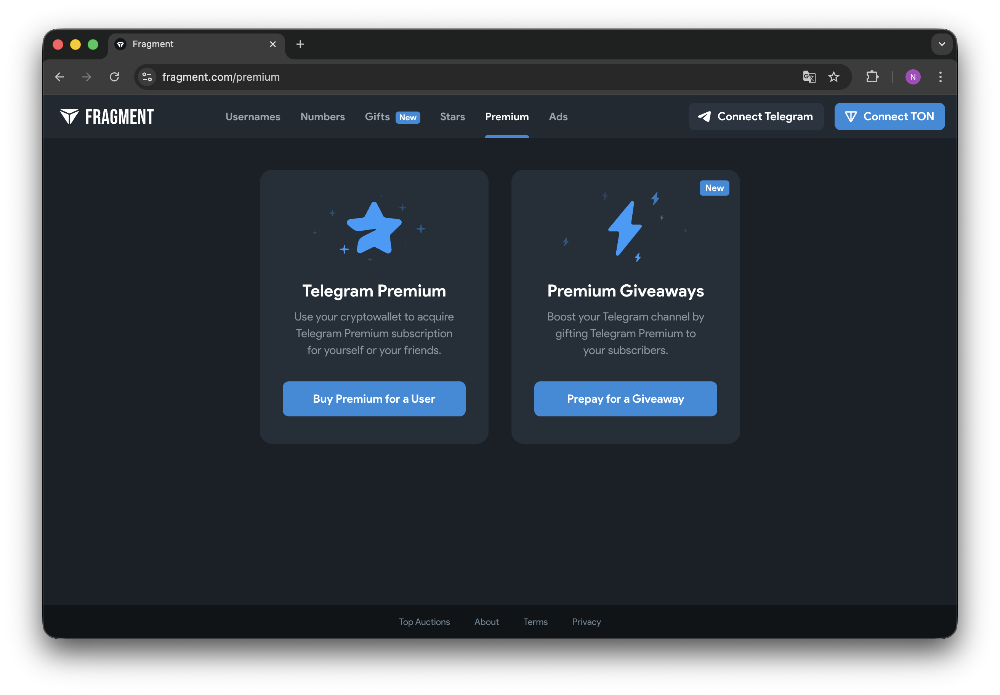

# 🌟 Fragment API — Система API для интеграций в ваши проекты.

[]()
[]()
[]()
[]()
[]()

---

<p align="center">
  
</p>

---

## 🧠 О проекте

**Fragment API** — это мульти-языковая система от **ScriptCode Team**, предназначенная для автоматизации процесса покупки **Telegram Stars** через [Fragment.com](https://fragment.com).  
Поддерживает 7 языков программирования и единый API-протокол, что позволяет использовать готовую логику на любой платформе.

Проект создан для разработчиков, которым нужна простая, быстрая и безопасная интеграция с Fragment API без лишнего кода.

---

📊 **Текущее состояние**

✅ **Python** — полностью готов  
✅ **JavaScript (Node.js)** — полностью готов  
✅ **C# (.NET)** — полностью готов  
✅ **C++** — полностью готов  
✅ **Go** — полностью готов  
✅ **Rust** — полностью готов  
✅ **PHP** — полностью готов  
✅ **TypeScript** — полностью готов  
✅ **SDK Module** — полностью готов 
⚠️ **Swift** — эксперементально (бета)  

---

## 💻 Компоненты проекта

🧩 **Core Logic**  
Каждая реализация содержит одинаковый функционал и архитектуру:

- ✅ Работа с **Fragment API**
- ✅ HTTP-запросы (`curl`, `HttpClient`, `fetch`, `net/http`)
- ✅ JSON-парсинг и обработка ответов
- ✅ Base64 → BOC декодирование payload
- ✅ Поддержка кошельков **TON V5R1**
- ✅ Проверка username и баланса

---

## 🔧 Основные функции

### 💰 `getBalance()`
Проверка текущего баланса TON-кошелька.

### 🚀 `sendTransaction()`
Отправка реальной TON-транзакции:
- создание кошелька **V5R1** из мнемоники  
- получение `seqno`  
- декодирование payload из **Base64 → BOC**  
- отправка транзакции с корректными параметрами  

---

## ⚙️ Настройка и конфигурация

Перед запуском укажите реальные данные в конфигурации каждого файла.

## 🧰 Установка: 
```
https://github.com/nyckye/Fragment-API.git
```
## 🔒 Безопасность

-	Все ключи и мнемоники храните только в .env
-	Не публикуйте cookies или mnemonic в открытом виде
-	Используйте отдельные кошельки для тестов
-	Проверяйте username перед каждой транзакцией

# 🕓 Последнее обновление

## 📅 2 ноября 2025 года

Обновления:
-  Добавлены реализации для всех 7 языков  
  (Python, JavaScript (Node.js), C#, C++, Go, Rust, PHP, TypeScript)
-  Оптимизирована работа с Fragment API
-  Добавлена поддержка TON Wallet V5R1
-  Исправлены ошибки декодирования payload
-  Обновлена структура проекта и конфигурация

## 🧩 Разработка и интеграция

Разработка и архитектура ядра — ScriptCode Team

🌍 Telegram: https://t.me/codescriptteam


### ⚠️ Disclaimer:
- Этот проект не является официальным продуктом Fragment или Telegram.
- Он представляет собой независимую интеграцию, использующую публичные API.
- Все права на платформу Fragment принадлежат их правообладателям.
